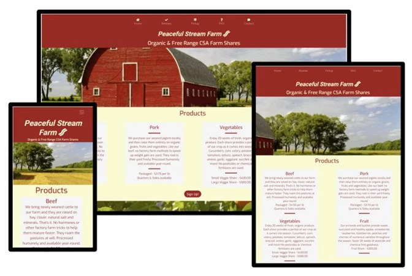

# Dan Rubach, Milestone Project 1 for Code Institute Full Stack Diploma - Peaceful Stream Farm CSA Website 

[View the project here.](https://drubach.github.io/PeacefulStreamFarm)

This is the main marketing website for Peaceful Stream Farms. It is designed to be responsive and accessible on a range of devices, making it easy to navigate and attarctive for potential customers.

<h2 align="center"></h2>

## User Experience (UX)

-   ### User stories

    -   #### First Time Visitor Goals

        1. As a First Time Visitor, I want to easily understand the main purpose of the site and learn more about the organisation.
        2. As a First Time Visitor, I want to be able to easily navigate throughout the site to find content.
        3. As a First Time Visitor, I want to look for testimonials to understand what their users think of them and see if they are trusted. 
        4. As a First Time Visitor, I also want to locate their social media links to see their followings on social media to determine how trusted and known they are.
        5. As a First Time Visitor, I want to know the prices they charge and the products that are available.

    -   #### Returning Visitor Goals

        1. As a Returning Visitor, I want to find information about changes to or problems with, my orders.
        2. As a Returning Visitor, I want to find the best way to get in contact with the organisation with any questions I may have.

    -   #### Frequent User Goals
        1. As a Frequent User, I want to check to see if there are any newly added products.
        2. As a Frequent User, I want to sign up to the email list to get notified when the yearly service starts.

-   ### Design
    -   #### Colour Scheme
        -   The two main colours used are firebrick and light goldenrod yellow.
    -   #### Typography
        -   The Roboto and Exo fonts are used throughout the whole website with Sans Serif as the fallback font in case for any reason the font isn't being imported into the site correctly. 
    -   #### Imagery
        -   Imagery was taken from web searchs to provide the impression and feeling of a thriving farm business. The images that relate to contact, contact thanks and pickup points are meant to show friendliness, pride and mild humor.
                
*   ### Wireframes
    -   The wireframes that were developed were ideational. After discussions with my mentor and input from friends and family, colors and design elements were adjusted to be more attractive.
    -   Site Wireframe - <a href="assets/wireframe/PeacefulStreamFarm-2.pdf"></a>
<a href="assets/images/PeacefulStreamFarm-2.pdf" class="image fit" type="application/pdf"><span>wireframe</span></a>

## Features
-   Responsive on all device sizes

## Technologies Used

### Languages Used
-   [HTML5](https://en.wikipedia.org/wiki/HTML5)
-   [CSS3](https://en.wikipedia.org/wiki/Cascading_Style_Sheets)

### Frameworks, Libraries & Programs Used
-----------------------------------------------------------------------------
1. [Bootstrap 4.2.1:](https://getbootstrap.com/docs/4.2/getting-started/introduction/)
    - Bootstrap was used to assist with the responsiveness and styling of the website.
1. [Google Fonts:](https://fonts.google.com/)
    - Google fonts were used to import the 'Roboto' and 'Exo' fonts into the style.css file which is used on all pages throughout the project.
1. [Font Awesome:](https://fontawesome.com/)
    - Font Awesome was used on all pages throughout the website to add icons for aesthetic and UX purposes.
1. [jQuery:](https://jquery.com/)
    - jQuery came with Bootstrap to make the navbar responsive but was also used for the accordion action for the FAQ pages.
1. [Git](https://git-scm.com/)
    - Git was used for version control by utilizing the Gitpod terminal to commit to Git and Push to GitHub.
1. [GitHub:](https://github.com/)
    - GitHub is used to store the projects code after being pushed from Git.
1. [Balsamiq:](https://balsamiq.com/)
    - Balsamiq was used to create the [wireframes](https://github.com/) during the design process.
1. [EZ-gif:](https://ezgif.com/png-to-webp)
    - The original images were converted to webp format to save space and speed the loading of the web pages using this online service.

## Testing

The W3C Markup Validator and W3C CSS Validator Services were used to validate every page of the project to ensure there were no syntax errors in the project.

-   [W3C Markup Validator](https://jigsaw.w3.org/css-validator/#validate_by_input) - [Results](https://drubach.github.io/PeacefulStreamFarm/html_results.html)
-   [W3C CSS Validator](https://jigsaw.w3.org/css-validator/#validate_by_input) - [Results](https://drubach.github.io/PeacefulStreamFarm/css_results.html/)

### Testing User Stories from User Experience (UX) Section

-   #### First Time Visitor Goals

    1. As a First Time Visitor, I want to easily understand the main purpose of the site and learn more about the organisation.
        1. Upon entering the site, users are automatically greeted with a clean and easily readable navigation bar to go to the page of their choice. Underneath there is a large barn image, a list of products and a "Sign Up!" Call to action button.
        2. The user has the option click the call any of the call to action buttons placed at various places on the main page, directly after answering the main questions a new user may have. These all lead to the contact page.

    2. As a First Time Visitor, I want to be able to easily be able to navigate throughout the site to find content.
        1. The site has been designed to be fluid and never to entrap the user. At the top of each page there is a clean navigation bar, each link describes the location or page they will end up at clearly.
        2. At the bottom of all pages there is a redirection call to action to ensure the user always has somewhere to go and doesn't feel trapped as they get to the bottom of the page.
        3. On the Contact Us Page, after a form response is submitted, a new page opens that thanks them for their submission and gives them a button to return to the top of the Home page.

    3. As a First Time Visitor, I want to look for testimonials to understand what their users think of them and see if they are trusted. I also want to locate their social media links to see their following on social media to determine how trusted and known they are.
        1. Once the new visitor has read the Products section of the Home page, they will notice the Reviews section.
        2. The user can also scroll to the bottom of any page on the site to locate social media links in the footer.
        3. At the bottom of the Home page, the user views the Pickup section that has the places and times to contact the farm. Alternatively they can contact the organisation on social media which highlights the links to them.
   
    4. As a First Time Visitor, I also want to locate their social media links to see their followings on social media to determine how trusted and known they are.
        1. On the bottom of every page are the social media links for the company.
    
    5. As a First Time Visitor, I want to know the prices they charge and the products that are available.
        1. This is a very competitive and retail oriented business. Knowing the products and prices is important and therefore placed as the main section of the Home page right after the nav bar and business name and tag line.

-   #### Returning Visitor Goals

    1. As a Returning Visitor, I want to find information about changes to or problems with my orders.
        1. These are clearly answered on the FAQ page which is accesible from the Home page with 1 click.
        2. The FAQ page has attractive images and instructions or answers for issues and a call to action.

    2. As a Returning Visitor, I want to find the best way to get in contact with the organisation with any questions I may have.
        1. The navigation bar clearly highlights the "Contact" Page.
        2. Here they can fill out the form on the page or are told that alternatively they can message the organisation on social media.
        3. The footer contains links to the organisations' Facebook, Twitter, Pinterest and Instagram pages.
        4. Whichever link they click, it will be open up in a new tab to ensure the user can easily get back to the website.

    3. As a Returning Visitor, I want to find the Facebook Group link so that I can join and interact with others in the community.
        1. The Facebook Page can be found at the footer of every page and will open a new tab for the user and more information can be found on the Facebook page.
        2. Alternatively, the user can scroll to the bottom of the Home page to find the Facebook Group redirect card and can easily join by clicking the "Join Now!" button which like any external link, will open in a new tab to ensure they can get back to the website easily.
        3. If the user is on the "Our Favourites" page they will also be greeted with a call to action button to invite the user to the Facebook group. The user is incentivized as they are told there is a weekly favourite product posted in the group.

-   #### Frequent User Goals

    1. 1. As a Frequent User, I want to check to see if there are any newly added products.
        1. The user would already be comfortable with the website layout and can easily scroll to that first on the Home page.

    2. As a Frequent User, I want to sign up to the email list to get notified when the yearly service starts.
        1. The user would already be comfortable with the website layout and can easily click the Contact link or the Social media links.

### Further Testing

-   The Website was tested on Google Chrome, Internet Explorer, Microsoft Edge and Safari browsers.
-   The website was viewed on a variety of devices such as Desktop, Laptop, iPhone7, iPhone 8 & iPhoneX.
-   Friends and family members were asked to review the site and documentation to point out any bugs and/or user experience issues.

### Known Bugs

-   On some older Apple mobile devices the background images do not scroll properly.

## Deployment

### GitHub Pages

The project was deployed to GitHub Pages using the following steps...

1. Log in to GitHub and locate the [GitHub Repository](https://github.com/)
2. At the top of the Repository (not top of page), locate the "Settings" Button on the menu.
    - Alternatively Click [Here](https://raw.githubusercontent.com/) for a GIF demonstrating the process starting from Step 2.
3. Scroll down the Settings page until you locate the "GitHub Pages" Section.
4. Under "Source", click the dropdown called "None" and select "Master Branch".
5. The page will automatically refresh.
6. Scroll back down through the page to locate the now published site [link](https://github.com) in the "GitHub Pages" section.

### Forking the GitHub Repository

By forking the GitHub Repository we make a copy of the original repository on our GitHub account to view and/or make changes without affecting the original repository by using the following steps...

1. Log in to GitHub and locate the [GitHub Repository](https://github.com/)
2. At the top of the Repository (not top of page) just above the "Settings" Button on the menu, locate the "Fork" Button.
3. You should now have a copy of the original repository in your GitHub account.

### Making a Local Clone

1. Log in to GitHub and locate the [GitHub Repository](https://github.com/)
2. Under the repository name, click "Clone or download".
3. To clone the repository using HTTPS, under "Clone with HTTPS", copy the link.
4. Open Git Bash
5. Change the current working directory to the location where you want the cloned directory to be made.
6. Type `git clone`, and then paste the URL you copied in Step 3.

```
$ git clone https://github.com/YOUR-USERNAME/YOUR-REPOSITORY
```

7. Press Enter. Your local clone will be created.

```
$ git clone https://github.com/YOUR-USERNAME/YOUR-REPOSITORY
> Cloning into `CI-Clone`...
> remote: Counting objects: 10, done.
> remote: Compressing objects: 100% (8/8), done.
> remove: Total 10 (delta 1), reused 10 (delta 1)
> Unpacking objects: 100% (10/10), done.
```

Click [Here](https://help.github.com/en/github/creating-cloning-and-archiving-repositories/cloning-a-repository#cloning-a-repository-to-github-desktop) to retrieve pictures for some of the buttons and more detailed explanations of the above process.

## Credits

### Code
-   The read me was created by editing this [sample readme](https://github.com/Code-Institute-Solutions/SampleREADME) from Code Institute.
-   A significant portion of the code for this project was copied and edited from the previous projects I completed in the program.
-   [Bootstrap4](https://getbootstrap.com/docs/4.2/getting-started/introduction/): Bootstrap Library used throughout the project mainly to make site responsive using the Bootstrap Grid System.

### Content
-   All content was written by the developer.

### Media
-   The screenshots of the application were created by the developer.
-   All other images were found by web searches. The source links are provided below.
    -   [berries](https://external-content.duckduckgo.com/iu/?u=https%3A%2F%2Fimages.pexels.com%2Fphotos%2F87818%2Fbackground-berries-berry-blackberries-87818.jpeg%3Fauto%3Dcompress%26cs%3Dtinysrgb%26dpr%3D1%26w%3D500&f=1&nofb=1)
    -   [bigBarn](https://external-content.duckduckgo.com/iu/?u=https%3A%2F%2Fwww.wallpaperup.com%2Fuploads%2Fwallpapers%2F2013%2F02%2F05%2F34896%2Fde2e06f99a18826a5b4341753b7faec1-700.jpg&f=1&nofb=1)
    -   [cowHi](https://external-content.duckduckgo.com/iu/?u=https%3A%2F%2Fwww.technative.io%2Fwp-content%2Fuploads%2F2017%2F07%2FAdobeStock_55774465.jpg&f=1&nofb=1)
    -   [cowsResting](https://external-content.duckduckgo.com/iu/?u=http%3A%2F%2Fgetwallpapers.com%2Fwallpaper%2Ffull%2Fd%2F7%2F6%2F941282-free-download-farm-animals-wallpaper-1920x1080.jpg&f=1&nofb=1)
    -   [fruitTree](https://external-content.duckduckgo.com/iu/?u=https%3A%2F%2Ftse3.mm.bing.net%2Fth%3Fid%3DOIP.7_-N9jP-nbSauyM-Ogm5twHaE8%26pid%3DApi&f=1)
    -   [marketPride](https://cdn-ds.com/blogs-media/sites/101/2015/05/07162715/Gale-Toyota-Farmers-Market.jpg)
    -   [red-barn-stream](https://www.amishcountrylodging.com/wp-content/uploads/2019/09/red-barn-field-slide.jpg)


### Acknowledgements
-   My Mentor for continuous helpful feedback.
-   My son, Jacob Rubach who is also a student in this program.
-   Tutor support at Code Institute for their support.
